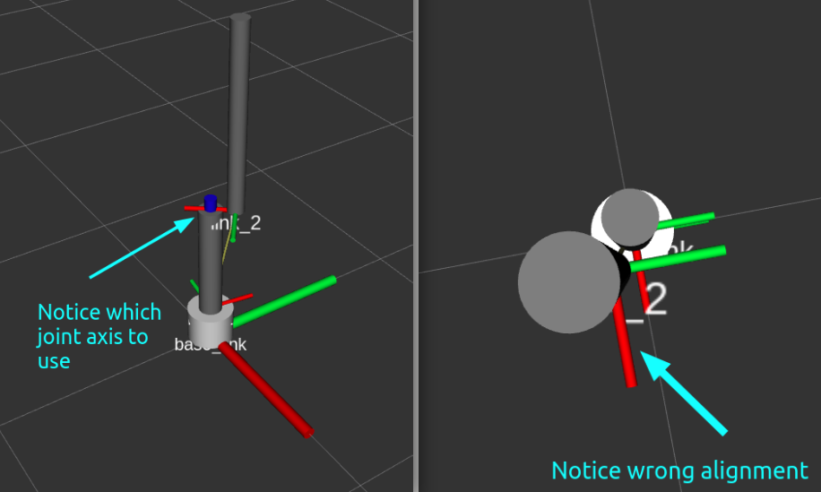
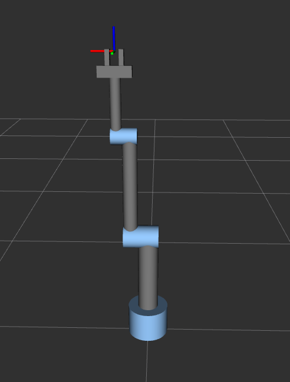
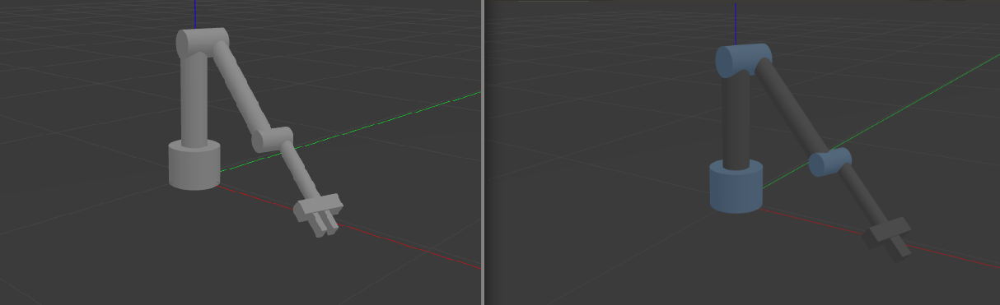
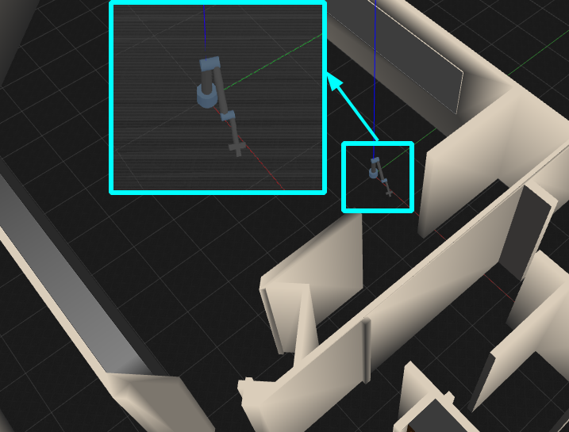
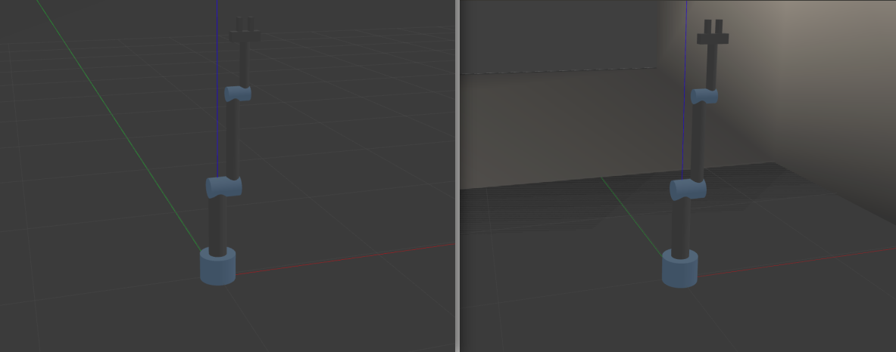
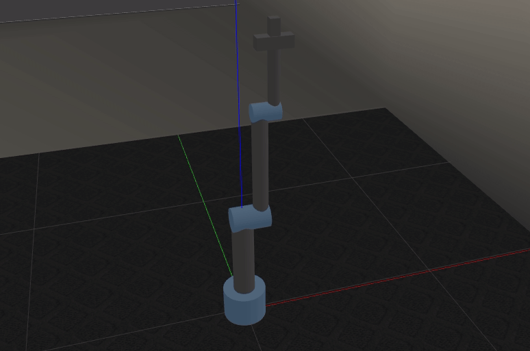

# RRR-robot-arm_ROS
ROS package for 3 DOF Revolute-Revolute-Revolute robot arm built from scratch. The aim of the package is to explain to fellow roboticists about the flow from the arms modeling to using MoveIt for motion planning.

In this package the arm and its gripper are build from scratch using URDF/xacro model. After building the model, the launch files required to visualize it in Rviz, and Gazebo are made. In the next step, MoveIt configuration package for the arm is created. The interface of the MoveIt package with Gazebo for motion planning is also done. 


To use this package, clone it to your ROS `workspace/src` directory as follows:
```
git clone https://github.com/Robotawi/rrr-arm.git
```
Then, build the workspace and the package is ready.

I will explain how to make each step as well as how to use the package at every point.

## 1. Robot visualization in Rviz
This is a must have skill to be able to make the model in the first place.  

To start the arm in Rviz, use the following command
```
roslaunch rrr_arm view_arm.launch 
```

**What does the above roslaunch command launch/start?**
It starts three components:
1. Loading the robot_description from the xacro model to ROS param server.
2. Start joint_state_publisher node.
3. Start robot_start_publisher node.
4. Start Rviz for see the model.

The contents of the launch file are as follows. The four components are exactly what is included. 
```
<?xml version="1.0"?>
<launch>

  <param name="robot_description" command="$(find xacro)/xacro --inorder $(find rrr_arm)/urdf/rrr_arm.xacro" />

  <node name="joint_state_publisher" pkg="joint_state_publisher_gui" type="joint_state_publisher_gui"/>
  <node name="robot_state_publisher" pkg="robot_state_publisher" type="robot_state_publisher"/> 
  <node name="rviz" pkg="rviz" type="rviz" args="-d $(find rrr_arm)/urdf.rviz" required="true"/>

</launch>
```
Building an arm from scratch is done in an iterative way. Build a link, visualize it, connect to a joint, and visualize again. It is very easy to make mistakes when making URDF/xacro models. The following is an example of the steps of building the arm


Then, the arm with the gripper (the result of launching the above file) is the following


Notice that at this moment, we just have a robot that is being **animated**. It can't be used in dynamics simulators like Gazebo. The xacro model being launched by the above launch file is the following.
___
<details><summary>CLICK here to see the details of the xacro file contents</summary>
<p>

```
<?xml version="1.0"?>

<!-- Make the namespace of the robot-->
<robot name="rrr_arm" xmlns:xacro="http://www.ros.org/wiki/xacro">
    <!--Define constants-->
    <xacro:property name="link_type" value="cuboidal" />
    <xacro:property name="M_PI" value="3.14159"/>
    <xacro:property name="mass_1" value="20" />
    <xacro:property name="mass_2" value="5" />
    <xacro:property name="mass_3" value="3" />
    <xacro:property name="mass_4" value="3" />
    <xacro:property name="mass_5" value="1" />
    <xacro:property name="mass_6" value="0.2" />
    <xacro:property name="radius_1" value="0.1" />  <!--base_link radius-->
    <xacro:property name="radius_2" value="0.05" /> <!--link_1 radius-->
    <xacro:property name="radius_3" value="0.035" /><!--link_2 radius-->
    <xacro:property name="radius_4" value="0.025" /><!--link_3 radius-->
    <xacro:property name="radius_5" value="0.025" /><!--gripper base redius/width-->
    <xacro:property name="radius_6" value="0.02" /> <!--finger radius/length-->

    <xacro:property name="length_1" value="0.15" /> <!--base_link length-->
    <xacro:property name="length_2" value="0.4" />  <!--link_1 length-->
    <xacro:property name="length_3" value="0.5" />  <!--link_2 length-->
    <xacro:property name="length_4" value="0.3" /> <!--link_3 length-->
    <xacro:property name="length_5" value="0.15" /> <!--gripper base length-->
    <xacro:property name="length_6" value="0.07" /> <!--finger length-->
    
    <!--Define colors-->
    <material name="Black">
        <color rgba="0.0 0.0 0.0 1.0"/>
    </material>
    <material name="Red">
        <color rgba="0.8 0.0 0.0 1.0"/>
    </material>
    <material name="Blue">
        <color rgba="0.0 0.0 1.0 1.0"/>
    </material>
    <material name="LightBlue">
        <color rgba="0.589 0.793 1.0 1.0"/>
    </material>
    <material name="Grey">
        <color rgba="0.5 0.5 0.5 1.0"/>
    </material>
    <material name="White">
        <color rgba="1.0 1.0 1.0 1.0"/>
    </material>

    <!-- macros for inertia -->
    <xacro:macro name="inertial_block" params="mass length radius">
        <inertial>
        <origin xyz="0 0 ${length/2}" rpy="0 0 0"/>
        <mass value="${mass}"/>
        <inertia
            ixx="${mass / 12.0 * (2*radius*2*radius + length*length)}" ixy="0.0" ixz="0.0"
            iyy="${mass / 12.0 * (length*length + 2*radius*2*radius)}" iyz="0.0"
            izz="${mass / 12.0 * (2*radius*2*radius + 2*radius*2*radius)}" />
    </inertial>
    </xacro:macro>
    <!--=============================================================================-->
    <!--base_link-->
    <link name="base_link">
        <visual>
            <origin xyz="0.0 0.0 ${length_1/2.0}" rpy="0.0 0.0 0.0"/>
            <geometry>
                <cylinder radius="${radius_1}" length="${length_1}"/>
            </geometry>
            <material name="LightBlue"/>
        </visual>

        <collision>
            <origin xyz="0.0 0.0 ${length_1/2.0}" rpy="0.0 0.0 0.0"/>
            <geometry>
                <cylinder radius="${radius_1}" length="${length_1}"/>
            </geometry>>
        </collision>
    </link>

    <joint name="joint_1" type="revolute">
        <origin xyz="0.0 0.0 ${length_1}" rpy="0.0 0.0 0.0"/>
        <parent link="base_link"/>
        <child link="link_1"/>
        <axis xyz="0.0 0.0 1"/>
        <limit lower="0.0" upper="${M_PI * 2}" effort="300.0" velocity="1.0"/>
    </joint>

    <!--=============================================================================-->
    <!--link_1-->
    <link name="link_1">
        <xacro:inertial_block mass="${mass_2}" length="${length_2}" radius="${radius_2}"/>
        <visual>
            <origin xyz="0.0 0.0 ${length_2/2.0}" rpy="0.0 0.0 0.0"/>
            <geometry>
                <cylinder radius="${radius_2}" length="${length_2}"/>
            </geometry>
            <material name="Grey"/>
        </visual>

        <collision>
            <origin xyz="0.0 0.0 ${length_2/2.0}" rpy="0.0 0.0 0.0"/>
            <geometry>
                <cylinder radius="${radius_2}" length="${length_2}"/>
            </geometry>>
        </collision>
    </link>

    <link name="link_1_endlink">
        <xacro:inertial_block mass="${mass_2/3.0}" length="${2*radius_2+2*radius_3}" radius="${radius_2}"/>
        <visual>
            <origin xyz="0.0 0.0 ${(2*radius_2+2*radius_3)/2.0}" rpy="0.0 0.0 0.0"/>
            <geometry>
                <cylinder radius="${radius_2*1.1}" length="${2*radius_2+2*radius_3}"/>
            </geometry>
            <material name="LightBlue"/>
        </visual>

        <collision>
            <origin xyz="0.0 0.0 ${(2*radius_2+2*radius_3)/2.0}" rpy="0.0 0.0 0.0"/>
            <geometry>
                <cylinder radius="${radius_2*1.1}" length="${2*radius_2+2*radius_3}"/>
            </geometry>
        </collision>
    </link>

    <joint name="link_1_endjoint" type="fixed">
        <origin xyz="${-radius_2} 0.0 ${length_2 - 0.01}" rpy="0.0 ${M_PI/2.0} 0.0"/>
        <parent link="link_1"/>
        <child link="link_1_endlink"/>
    </joint>


    <joint name="joint_2" type="revolute">
        <origin xyz="${radius_2 + radius_3} 0.0 ${length_2}" rpy="0.0 0.0 0.0"/>
        <parent link="link_1"/>
        <child link="link_2"/>
        <axis xyz="1.0 0.0 0.0"/>
        <limit lower="0.0" upper="${M_PI * 2}" effort="300.0" velocity="1.0"/>
    </joint>

    <!--=============================================================================-->
    <!--link_2-->
    <link name="link_2">
        <xacro:inertial_block mass="${mass_3}" length="${length_3}" radius="${radius_3}"/>
        <visual>
            <origin xyz="0.0 0.0 ${length_3/2.0}" rpy="0.0 0.0 0.0"/>
            <geometry>
                <cylinder radius="${radius_3}" length="${length_3}"/>
            </geometry>
            <material name="Grey"/>
        </visual>

        <collision>
            <origin xyz="0.0 0.0 ${length_3/2.0}" rpy="0.0 0.0 0.0"/>
            <geometry>
                <cylinder radius="${radius_3}" length="${length_3}"/>
            </geometry>>
        </collision>
    </link>

    <link name="link_2_endlink">
        <xacro:inertial_block mass="${mass_3/3.0}" length="${2*radius_3+2*radius_4}" radius="${radius_3}"/>
        <visual>
            <origin xyz="0.0 0.0 ${(2*radius_3+2*radius_4)/2.0}" rpy="0.0 0.0 0.0"/>
            <geometry>
                <cylinder radius="${radius_3*1.1}" length="${2*radius_3+2*radius_4}"/>
            </geometry>
            <material name="LightBlue"/>
        </visual>

        <collision>
            <origin xyz="0.0 0.0 ${(2*radius_3+2*radius_4)/2.0}" rpy="0.0 0.0 0.0"/>
            <geometry>
                <cylinder radius="${radius_3*1.1}" length="${2*radius_3+2*radius_4}"/>
            </geometry>
        </collision>
    </link>

    <joint name="link_2_endjoint" type="fixed">
        <origin xyz="${-radius_3} 0.0 ${length_3 - 0.01}" rpy="0.0 ${M_PI/2.0} 0.0"/>
        <parent link="link_2"/>
        <child link="link_2_endlink"/>
    </joint>

    <joint name="joint_3" type="revolute">
        <origin xyz="${radius_3 + radius_4} 0.0 ${length_3 - radius_3}" rpy="0.0 0.0 0.0"/>
        <parent link="link_2"/>
        <child link="link_3"/>
        <axis xyz="1.0 0.0 0.0"/>
        <limit lower="0.0" upper="${M_PI * 2}" effort="300.0" velocity="1.0"/>
    </joint>

    <!--=============================================================================-->
    <!--link_3-->
    <link name="link_3">
        <xacro:inertial_block mass="${mass_4}" length="${length_4}" radius="${radius_4}"/>
        <visual>
            <origin xyz="0.0 0.0 ${length_4/2.0}" rpy="0.0 0.0 0.0"/>
            <geometry>
                <cylinder radius="${radius_4}" length="${length_4}"/>
            </geometry>
            <material name="Grey"/>
        </visual>

        <collision>
            <origin xyz="0.0 0.0 ${length_4/2.0}" rpy="0.0 0.0 0.0"/>
            <geometry>
                <cylinder radius="${radius_4}" length="${length_4}"/>
            </geometry>>
        </collision>
    </link>

    <joint name="joint_4" type="revolute">
        <origin xyz="0.0 0.0 ${length_4}" rpy="0.0 0.0 0.0"/>
        <parent link="link_3"/>
        <child link="link_4"/>
        <axis xyz="0.0 0.0 01.0"/>
        <limit lower="0.0" upper="${M_PI * 2}" effort="300.0" velocity="1.0"/>
    </joint>

    <!--=============================================================================-->
    <!--link_4-->
    <link name="link_4">
        <xacro:inertial_block mass="${mass_5}" length="${length_5}" radius="${radius_5}"/>
        <visual>
            <origin xyz="0.0 0.0 ${radius_5/2.0}" rpy="0.0 ${M_PI/2.0} 0.0"/>
            <geometry>
                <box size="${radius_5*2} ${radius_5*2} ${length_5}"/>
            </geometry>
            <material name="Grey"/>
        </visual>

        <collision>
            <origin xyz="0.0 0.0 ${radius_5/2.0}" rpy="0.0 0.0 0.0"/>
            <geometry>
                <box size="${radius_5*2} ${radius_5*2} ${length_5}"/>
            </geometry>>
        </collision>
    </link>

    <joint name="gripper_joint_1" type="prismatic">
        <origin xyz="0.0 0.0 ${radius_5 + length_6/2.0}" rpy="0.0 0.0 0.0"/>
        <parent link="link_4"/>
        <child link="gripper_link_1"/>
        <axis xyz="1.0 0.0 0.0"/>
        <limit lower="${radius_6/2.0}" upper="0.05" effort="100.0" velocity="1.0"/>
    </joint>

    <joint name="gripper_joint_2" type="prismatic">
        <origin xyz="0.0 0.0 ${radius_5 + length_6/2.0}" rpy="0.0 0.0 0.0"/>
        <parent link="link_4"/>
        <child link="gripper_link_2"/>
        <axis xyz="1.0 0.0 0.0"/>
        <limit lower="-0.05" upper="${-radius_6/2.0}" effort="100.0" velocity="1.0"/>
    </joint>

    <joint name="gripper_frame_joint" type="fixed">
        <origin xyz="0.0 0.0 ${radius_5*2 + length_6/2 + 0.01}" rpy="0.0 0.0 0.0"/>
        <parent link="link_4"/>
        <child link="gripper_frame_cp"/>
    </joint>
    <!--=============================================================================-->
    <!--gripper_link_1-->
    <link name="gripper_link_1">
        <xacro:inertial_block mass="${mass_6}" length="${length_6}" radius="${radius_6}"/>
        <visual>
            <origin xyz="0.0 0.0 ${radius_6/2.0}" rpy="0.0 0.0 0.0"/>
            <geometry>
                <box size="${radius_6} ${radius_6*2} ${length_6}"/>
            </geometry>
            <material name="Grey"/>
        </visual>

        <collision>
            <origin xyz="0.0 0.0 ${radius_6/2.0}" rpy="0.0 0.0 0.0"/>
            <geometry>
                <box size="${radius_6*2} ${radius_6*2} ${length_6}"/>
            </geometry>>
        </collision>
    </link>

    <!--=============================================================================-->
    <!--gripper_link_2-->
    <link name="gripper_link_2">
        <xacro:inertial_block mass="${mass_6}" length="${length_6}" radius="${radius_6}"/>
        <visual>
            <origin xyz="0.0 0.0 ${radius_6/2.0}" rpy="0.0 0.0 0.0"/>
            <geometry>
                <box size="${radius_6} ${radius_6*2} ${length_6}"/>
            </geometry>
            <material name="Grey"/>
        </visual>

        <collision>
            <origin xyz="0.0 0.0 ${radius_6/2.0}" rpy="0.0 0.0 0.0"/>
            <geometry>
                <box size="${radius_6*2} ${radius_6*2} ${length_6}"/>
            </geometry>>
        </collision>
    </link>

    <!--=============================================================================-->
    <!--gripper_frame_cp-->
    <link name="gripper_frame_cp">
        <xacro:inertial_block mass="${0.001}" length="${0.001}" radius="${0.001}"/>
        <visual>
            <origin xyz="0.0 0.0 0.0" rpy="0.0 0.0 0.0"/>
            <geometry>
                <box size="${0.001} ${0.001} ${0.001}"/>
            </geometry>
            <material name="Grey"/>
        </visual>

        <collision>
            <origin xyz="0.0 0.0 0.0" rpy="0.0 0.0 0.0"/>
            <geometry>
                <box size="${0.001} ${0.001} ${0.001}"/>
            </geometry>
        </collision>
    </link>

</robot>

```

</p>
</details>

___
**Notice** that the model doesn't have any tags that make possible to interface its links and joints with Gazebo. Those elements are usually included in `<gazebo>` tag and they will come in the next step.


## 2. Interface the robot with Gazebo 
Dynamic simulators are very important for many reasons, like the validation of the robot design, actuators sizing, and motion planning performance. 

In the following part, I will add the required Gazebo tags to the xacro mode to prepare the model to be simulated in Gazebo. Then, launch files to load all the components to start the simulation in an empty Gazebo world as well as a normal world are included. The first thing is to add a `view_robot_gazebo_empty_world.launch` and `view_robot_gazebo_world.launch` file in the robot package `rrr_arm/launch` directory

The following launch file starts/spawns the robot in an empty Gazebo world. 
```
roslaunch rrr_arm view_arm_gazebo_empty_world.launch
```

The following launch file starts/spawns the robot in Willow garage world that comes with `gazebo_ros` package.
```
roslaunch rrr_arm view_arm_gazebo_world.launch
```

If we spawn the robot using the above commands, gazebo simulator opens and the robot appears like fall down because there are no actuators installed at the joints yet as shown below. (On the left with no colors, and on the right after `gazebo` colors are added). Notice that Rviz and Gazebo coloring are different. 


This is the robot in willow_garage world spawned by the second launch file.


### Adding actuators and controllers to the robot model
The reason why the arm fall down in the previous images is that there is still no controlled actuators that can keep it upright at a specific pose. In the following, I will add the actuators which are represented by `transmission` elements/tags in the xacro model. Then, configure `ros_controllers` that will provide the enough effort to balance the arm.

**Notice** that the simplicity of interfacing actuators/controllers makes Gazebo the best simulator to start with your robot arm compared to other multi-body dynamic (MBD) simulators, like ADAMS for example. In case of using ADAMS, we must build controllers from scratch using ADAMS or MATLAB interface.

Running the following 
**Actuators** are added to the xacro in for of transmissions as follows
```
<!-- macros for transmission -->
    <xacro:macro name="transmission_block" params="joint_name">
	  <transmission name="tran1">
	    <type>transmission_interface/SimpleTransmission</type>
	    <joint name="${joint_name}">
	      <hardwareInterface>hardware_interface/PositionJointInterface</hardwareInterface>
	    </joint>
	    <actuator name="motor1">
	      <hardwareInterface>hardware_interface/PositionJointInterface</hardwareInterface>
	      <mechanicalReduction>1</mechanicalReduction>
	    </actuator>
	  </transmission>
   </xacro:macro>
```

Then a corresponding controller should be added to the `rrr_arm/config`. The above launch files starts four components at the same time. 
1. Include a launch file that launches a robot in a world/empty world.
2. Load the controller config .yaml file that we write for our robot.
3. Spawn the robot controller.
4. Start robot start publisher node.

Now, we can see the robot spawned upright either in the empty world or the willow garage world with the following commands 
Spawn in an empty world
```
roslaunch rrr_arm view_arm_gazebo_control_empty_world.launch 

```

Spawn in Willow Garage world 
```
roslaunch rrr_arm view_arm_gazebo_control_world.launch 
```


If everything goes right, we should see the following topics when we run `rostopic list`
```
rostopic list

/clock
/gazebo/link_states
/gazebo/model_states
/gazebo/parameter_descriptions
/gazebo/parameter_updates
/gazebo/set_link_state
/gazebo/set_model_state
/rosout
/rosout_agg
/rrr_arm/joint1_position_controller/command
/rrr_arm/joint2_position_controller/command
/rrr_arm/joint3_position_controller/command
/rrr_arm/joint4_position_controller/command
/rrr_arm/joint5_position_controller/command
/rrr_arm/joint6_position_controller/command
/rrr_arm/joint_states
/tf
/tf_static
```
As we can the the command topic are being published. This is the way how all the interesting stuff, like seeing the planned motion, will take place. We can also publish to those topic manually as follows.



Open the gripper
```
rostopic pub /rrr_arm/joint5_position_controller/command  std_msgs/Float64 "data: 0.03" & rostopic pub /rrr_arm/joint6_position_controller/command  std_msgs/Float64 "data: -0.03"
```
Close the gripper
```
rostopic pub /rrr_arm/joint5_position_controller/command  std_msgs/Float64 "data: 0.03" & rostopic pub /rrr_arm/joint6_position_controller/command  std_msgs/Float64 "data: -0.03"
```

Move the arm
```
rostopic pub /rrr_arm/joint1_position_controller/command  std_msgs/Float64 "data: 1.0" & rostopic pub /rrr_arm/joint2_position_controller/command  std_msgs/Float64 "data: 1.0" & rostopic pub /rrr_arm/joint3_position_controller/command  std_msgs/Float64 "data: 1.5" & rostopic pub /rrr_arm/joint4_position_controller/command std_msgs/Float64 "data: 1.5"
```

The interface with Gazebo is done at this point. The robot is spawned with all the controllers and their related command topics and we publish to them from the command line or write our nodes to publish on the command topics.